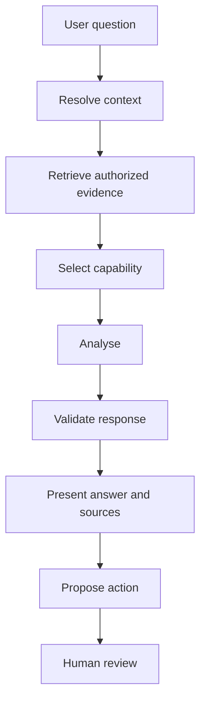

# Copilot streaming events

AX-EP03 preserves `/api/chat/start` and the existing durable runtime SSE subscription. One execution/trace identity is retained across start, progress, continuation, cancellation, and completion.

Delivery metadata may represent progress equivalent to `context.resolved`, `retrieval.started`, `evidence.found`, `analysis.started`, `structured_response.ready`, and `proposed_action.ready`. Existing consumers continue to receive canonical runtime events. Internal prompts and chain-of-thought are never streamed.

