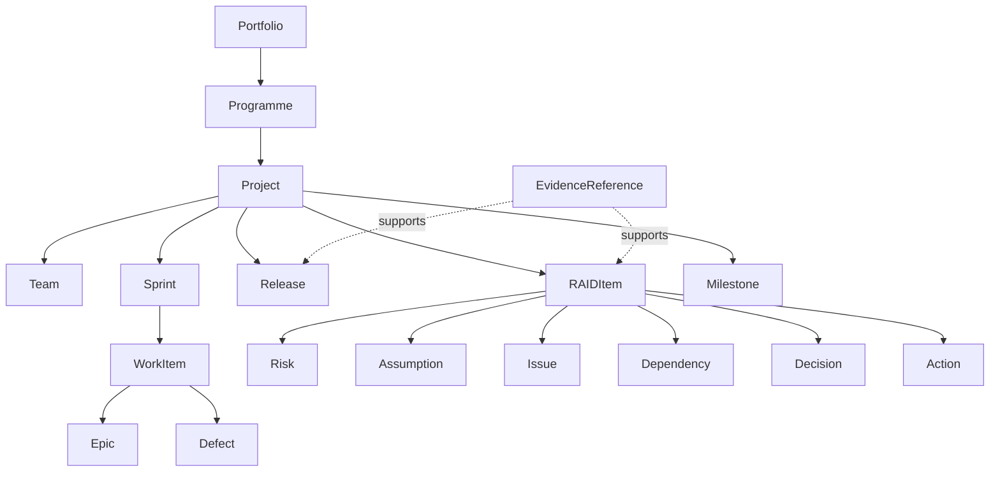

# Axiom delivery domain model

AX-EP01 establishes canonical, tenant-aware Python contracts in `backend/app/delivery/domain.py` and aligned TypeScript summaries in `frontend/src/types/delivery.ts`. These contracts are persistence-independent by design; no production schema is changed by this epic.

## Contract rules

- Every aggregate and record is tenant-scoped.
- External references support manual, Jira, Azure DevOps, ServiceNow, SharePoint, Teams, and import sources.
- Health and status values are centralized and `UNKNOWN` is explicit.
- `WorkItem` is deliberately generic so Jira and Azure DevOps hierarchies can map without duplicating models.
- RAID uses a discriminated `item_type` with an extensible `details` object for type-specific attributes.
- Evidence stores references, summaries, provenance, timestamps, and optional hashes—not copied confidential source content.

## Persistence plan

Persistence is deferred until the aggregate boundaries and integration mappings are approved. The forward-only Alembic plan is:

1. Introduce shared tenant/source/audit mixins without modifying existing tables.
2. Add portfolio, programme, project, team, sprint, work-item, defect, release, RAID, milestone, and evidence tables.
3. Add tenant plus external-ID uniqueness constraints and relationship indexes.
4. Add evidence association tables for releases, RAID records, recommendations, and future AI responses.
5. Add repository-level tenant filters and tests before enabling writes.

No existing `actions`, runtime dependency, audit, or knowledge-source table should be renamed or repurposed.

## Demonstration data

Current delivery demonstrations are centralized frontend mocks and are entirely synthetic. Real organizations, people, credentials, and client data must not be used.
