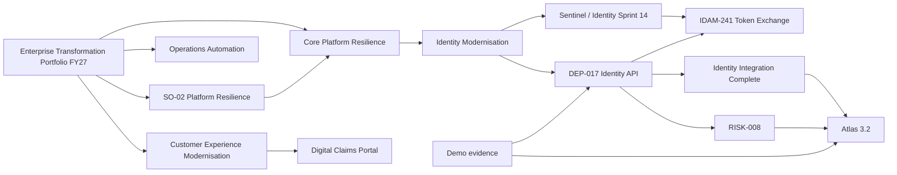

# Demonstration data relationships

Every identifier is deterministic UUIDv5. The validator checks hierarchy counts, two endpoints per dependency, demo classification, and reconciliation of programme totals to £18.40M approved, £8.15M actual, and £19.25M forecast.
